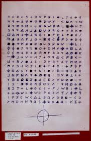
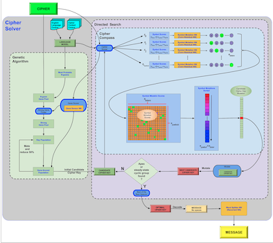

>>> THIS PAGE IS CURRENTLY BEING EDITED. Please check back aftr Feb 10, 2023. <<<
# Cipher-Public-Preview

This is a public preview of my Cipher project for solving the infamous Zodiac Killer cipher.  
 

I started this project one evening a couple of years ago, casually looking at the unsolved Z340 cipher that the Zodiac Killer sent to authorities back in 1969. Since then, I have devoted well over 1000 hours, breaking down and solving the problem, and I've made distinct, demonstable progress. 

The project includes a multi-level system of models and tools for systematically attacking and breaking homophonic substitution ciphers. There are a few dozen notebooks, about 10,000 lines of python code, almost a TB of generated training data, and several machine learning and predictive models that comprise deep neural networks (convolutional and recursive), and genetic algorithms. 

Homophonic Cipher Solver
The Homophonic Cipher Solver is an orchestrated suite of algorithms that I developed over a 3 year period. The system is shown schematically in the figure below. The impetus for this research effort was to ultimately break the well known Zodiac 340-character cipher that had remained unsolved since 1969 when it was sent to the police by the infamous Zodiac serial killer. 

​

The solver system consists of a multistage approach, involving :

   

a Zodiac Killer specific language model (built by combining the corpus of his 15 or so letters with a larger English language corpus)    

​

generating millions of hypothetical Zodiac-styled test messages (reflecting the Zodiac Killer's particular vocabulary and his typical typos)

​

a technique for generating cipher keys with precise values of "homophonicity", targeted to be match the homophonicity of the unsolved Zodiac cipher

​

a genetic algorithm to find an initial candidate key that has a high probability of containing a required (and calculated) threshold of correct symbol-to-letter mappings

​

a deep convolutional neural network to then perform a directed search for a final solution key that produces a coherent decoded message

This work produced some surprisingly successful and valuable results, including a novel design for a powerful genetic algorithm, and a unique approach for the feature engineering and scoring used in combination with a deep convolutional neural network. It also resulted in the developing a useful metric for quantifying the complexity of a homophonic cipher key, which I dubbed "homophonicity", along with techniques to generate random cipher keys having specific values of homophonicity. (This new metric is described in detail in the Primer on Cipher Metrics document.)

​

On a large test set of ciphers of similar size, structure, and language as the Zodiac Cipher, (but lower homophonicity), the system was able to to decrypt 99.5% of the ciphers, with 100% "clarity". 

 

Below are two examples showing the power of the solver. the first shows a typical result illustrative of the vast majority of the test cases. The cipher was solved to 100% clarity in just 7 iteration steps (taking a few seconds on a laptop.)

​

The second is illustrative of the cipher that took the longest for the solver to solve to 100% clarity. This one took roughly 45 iteration steps (and about 30 seconds on a laptop).

 

Update on Status of Research:

​

By late 2020, this solver system was looking extremely promising. What remained was to analyze its performance with ciphers of increasing homophonicity, and then extrapolate to determine the amount of generated training data and computing resources that would be statistically required to ensure success with the actual Zodiac Cipher.

​

(Theoretically the amount of information actually remaining in an encrypted message is dependent on both the length of the message and the homophonicity of the cipher key. So predicting the success of the solver would also include an estimation of whether or not  the Zodiac Cipher was fundamentally even solvable.)

​

It was getting exciting and I had been communicating some early results to fellow researchers who were working on Zodiac Cipher, including David Oranchak. 

​

On December 11, 2020, however, I woke up to find email from David saying that he (and two colleagues) had just solved the Zodiac 340 Cipher.  In just 5 seconds, my previous years of work seemed to implode.

​

Make no mistake -- the achievement of David and his team was well deserved! David spent many years working on this problem and disseminating many of his findings in lectures and videos, and there was probably no one who had a better understanding of the statistical characteristics of the Zodiac cipher than David.

 

And, in fact, there was still much work to be done before my efforts were likely to actually break the cipher. I anticipated having to still discover (using even further statistical analysis and machine learning models)  what probable transpositions that the Zodiac Killer used in combination with his substitution cipher key.  This was going to take a sizable research effort in itself. As it turned out, those transpositions were rather complex and David would not have succeeded without his clever and insightful manual inspections.

​

While the current work is certainly worth continuing, my enthusiasm for doing so took a hit once the solution to the particular problem case that had launched the effort was suddenly no longer needed.  At some point, however, I expect to regain both the time and motivation to continue this research.

​

Congratulations to David Oranchak and his team for solving a cipher that had gone 51 years unsolved!

​
